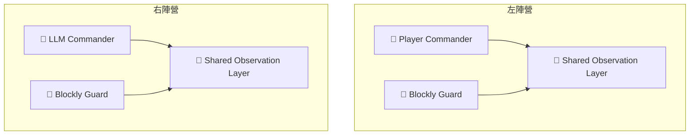

# ⚔️ Shadow Protocol 鏡像對抗模式比較  
> 「在對稱的數位戰場上，光與影的策略才是真正的差別。」

---

## 🌐 模式概要

《Shadow Protocol》的對戰系統以**鏡像地圖（Mirror Map）**為基礎：  
雙方在完全對稱的場景中開局，職業配置、地形、光源與卷軸位置皆相同。  
為了適應不同層級的玩家與 AI 參與方式，系統設計了兩種主要對戰模式：

- 🧱 **自走模式（Autonomous Mode）**  
- 🧭 **主帥模式（Commander Mode）**

這兩種模式共享相同的世界規則與結算架構，  
但在「控制權」與「觀測層級」上有根本差異。

---

## ⚔️ 模式對照表

| 面向 | 🧱 自走模式 Autonomous Mode | 🧭 主帥模式 Commander Mode |
|------|------------------------------|------------------------------|
| **控制權** | 雙方所有角色皆由 Blockly 腳本控制（人類與 AI 皆須撰寫腳本） | 人類與 LLM 各控制 1 名主帥，其餘單位由 Blockly 腳本執行 |
| **玩家參與** | ❌ 無即時操作，勝負完全由腳本邏輯決定 | ✅ 玩家可直接操作主帥角色（如忍者或警衛） |
| **AI 控制方式** | 以預寫 Blockly 腳本作為固定策略，無即時推理 | LLM 即時生成行動，根據相同觀測層決策 |
| **觀測資訊** | 每個角色僅能使用自身觀測（個體視角） | 己方所有單位的可見範圍整合為共享觀測層（Fog of War 下） |
| **視野機制** | 個體式（每腳色獨立感知） | 團隊式（己方共用迷霧可見區域） |
| **資訊隔離** | 嚴格分離（角色間不共享資訊） | 公平共享（雙方主帥在相同觀測層下決策） |
| **策略焦點** | 腳本演算法設計、行為觸發邏輯、步驟規劃 | 戰場判斷、策略指揮、人機心理博弈 |
| **回合同步** | 批次執行所有腳本 → 統一結算結果 | 主帥與腳本同時行動 → 系統同步結算 |
| **可重播性** | 完全可重現（純演算法行為） | 半可重現（受玩家或 LLM 即時決策影響） |
| **對戰公平性** | 雙方腳本結構對稱，演算法對演算法 | 雙方觀測層一致，人機策略對稱 |
| **遊戲節奏** | 穩定、可模擬 | 動態、有心理變化 |
| **教育重點** | 程式邏輯、演算法分析、AI 策略對比 | 部分觀測決策、資訊倫理、人機協作 |
| **適用場景** | Blockly 腳本比賽、AI 對戰展示、RL 平台教學 | 玩家 vs LLM 對戰、展示賽、人機研究 |

---

## 🧱 自走模式 Autonomous Mode
> 「讓演算法自己說話。」

### 核心概念  
- 雙方皆以 Blockly 腳本撰寫各自的角色策略。  
- 每個角色僅能使用自身觀測資訊（視覺 / 聽覺 / 光影 / 卷軸距離）。  
- 適合純演算法競技、策略展示或 AI 教學實驗。

### 系統結構
```mermaid
graph TD
  A1[🥷 Blockly Ninja (Player)] -->|自身觀測| Engine
  A2[👮 Blockly Guard (Player)] -->|自身觀測| Engine
  B1[🥷 Blockly Ninja (AI)] -->|自身觀測| Engine
  B2[👮 Blockly Guard (AI)] -->|自身觀測| Engine
  Engine[⚙️ Shadow Engine 結算系統]
```

---

## 🧭 主帥模式 Commander Mode
> 「你是主帥，能看到己方的一切——但敵方仍潛藏在迷霧之中。」

### 核心概念  
- 人類與 LLM 各控制陣營中的一名主帥角色。  
- 其餘角色由己方 Blockly 腳本自動行動。  
- 己方所有角色的感知範圍合併成共享視野（Fog of War），  
  主帥與腳本皆基於同一觀測層行動。

### 系統結構


---

## 🧠 模式哲學對比

| 核心理念 | 自走模式 | 主帥模式 |
|-----------|------------|------------|
| **哲學定位** | 「演算法之戰」 | 「智慧與觀測之戰」 |
| **人類角色** | 腳本設計者（規則的制定者） | 指揮官（即時決策者） |
| **AI 角色** | 腳本執行者（程式化行動） | 策略對手（語言推理決策） |
| **核心挑戰** | 腳本邏輯的精度與效率 | 資訊不完全下的判斷與適應 |
| **體驗重點** | 預測、規劃、驗證 | 博弈、觀測、臨機應變 |
| **最終目標** | 最優化策略演算法 | 可與人類平等對弈的智能行為 |

---

## 🧾 總結

| 面向 | 自走模式 | 主帥模式 |
|------|------------|------------|
| **本質** | Blockly 腳本對抗模式 | 人機主帥對抗模式 |
| **焦點** | 腳本邏輯與演算法競技 | 部分觀測下的智慧博弈 |
| **觀測層級** | 個體視角 | 團隊共享視野（Fog of War） |
| **控制節奏** | 完全自動 | 人機互動 |
| **適用場景** | AI 教學、Blockly 比賽、策略展示 | 玩家體驗、人機對戰、AI 哲學實驗 |
