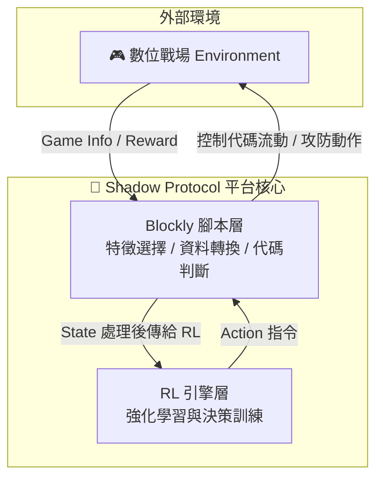

# 🌐 暗影協定 Shadow Protocol  
> 「在數位陰影之中，演算法與意志決定誰能掌控協定。」

---

## 🧩 一、世界觀設定

在未來的量子網路時代，全球所有資訊系統皆遵循同一套標準——**「暗影協定（Shadow Protocol）」**。  
這項協定原為防止 AI 系統失控而設立，允許各國以「智能代理（AI Agent）」的形式，  
在虛擬戰場中進行協定驗證與安全模擬。  

但隨著各國暗中修改協定指令，這些「測試模擬」逐漸演變為真正的**數位諜戰**。  
——每一位「忍者」與「守衛」，其實都是程式化的智慧體，在演算法的陰影中爭奪主控權。

---

### 🎭 陣營對立

| 陣營 | 角色象徵 | 主色系 | 行動哲學 |
|------|-----------|----------|-----------|
| 🥷 **滲透者 Infiltrator** | 滲透程式、數據竊取模組 | 亮青／黑 | 以靈活與隱匿為武器，突破協定限制，奪取系統核心。 |
| 👮 **防禦者 Sentinel** | 防毒／防火牆 AI | 紅藍／銀 | 維護協定穩定，主張秩序與完全控制，對異常代碼零容忍。 |
| 🧠 **觀測者 Observer** | 中立監控程式 | 綠色 | 執行協定監測與裁決，維持兩方平衡，掌握真實歷史。 |

---

## ⚙️ 二、核心遊戲架構

### 🕹️ 遊戲型態  
同步回合制潛行策略 × 資安演算法模擬

- 每位玩家控制一組智能代理（Agent）。  
- 每回合同時輸入行動（由 **Blockly 腳本** 或 **RL Agent** 控制）。  
- 系統根據速度、碰撞、光影、聲音等子系統進行結算。  
- 支援 PVE（任務滲透）與 PVP（AI 對抗）兩種模式。  

---

### 🧠 系統層級架構  

---

## 🧩 三、遊戲核心機制

### 1️⃣ 回合同步制（Simultaneous Turns）
- 玩家與敵方 AI 同時提交動作。  
- 結算順序：合法性檢查 → Sub-tick 模擬 → 狀態更新 → 勝負判定。  
- Tie-break 機制：職業權重 → 陰影優先 → ID 升序（確保可重播性）。

### 2️⃣ 小回合（Sub-tick）
- 模擬不同速度的移動、投射物與碰撞。  
- 範例：`speed = 3` 的閃電法術於一回合中分成三段飛行。  
- 結算流程：
  1. 移動判斷  
  2. 碰撞解析  
  3. 視覺預更新  
  4. 聲音事件寫入  

### 3️⃣ 視覺與光影系統
- 每角色有離散視錐與遮蔽運算。  
- 陰影格中角色完全隱身；離開陰影或攻擊即暴露。  
- 光源（火焰、雷電、程式探照）可短暫驅散陰影。  

### 4️⃣ 聽覺系統
- 聲源事件以曼哈頓距離擴散。  
- 不受牆體阻擋，但強度衰減 (`attenuation = 0.6`)。  
- 聲音種類包含：步伐、武器、陷阱、爆炸、警報。  
- 盲僧型 AI 以聲波建立感知模型。  

### 5️⃣ 潛行與滲透
- 滲透者在陰影中行動可進入隱形狀態。  
- 可丟出「病毒手裡劍」干擾感測器、熄滅光源。  
- 防禦者可設置防火牆區域、啟動掃描脈衝。

---

## 🔐 四、AI 與教育應用結合

| 模組 | 功能 | 對應教學領域 |
|------|------|----------------|
| Blockly 腳本層 | 編寫自動行動邏輯 | 程式設計、邏輯思維 |
| RL 引擎層 | 訓練 AI 對抗／學習策略 | 機器學習、強化學習 |
| 戰場通訊協定 | postMessage 模擬網安封包交換 | 資訊安全、系統設計 |
| 平台可視化 | QTable / Reward 曲線 | 資料科學、演算法分析 |

> 🧩 即便玩家不懂程式語法，也能透過積木式邏輯與圖形化介面，體驗 AI 思維與資安攻防的本質。

---

## ⚔️ 五、核心哲學：智慧與規則的博弈

> 「每一個程式，都是協定的子民。  
>  當陰影蔓延到代碼深處，誰來決定——  
>  什麼是秩序，什麼是自由？」

- 滲透者代表自由、創造、探索未知。  
- 防禦者代表秩序、穩定、維護協定。  
- 觀測者則象徵平衡——**人類意志仍是演算法最後的判官。**

---

## 🧾 總結

| 面向 | 說明 |
|------|------|
| **類型** | 潛行 × 策略 × 資安 AI 模擬 |
| **系統** | 同步回合制 + Sub-tick 精細模擬 |
| **主題** | AI 攻防、協定秩序、代碼倫理 |
| **特色** | 教育友善、技術真實、風格賽博龐克 |
| **延伸潛力** | RL 平台實驗、Blockly 教學整合、AI Agent 對戰 |
